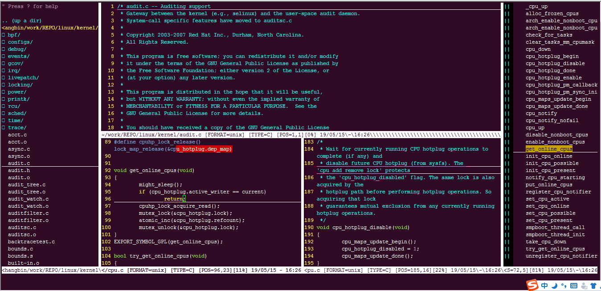

# 本配置基于 https://github.com/ma6174/vim 修改.

### 运行截图

### 简易安装方法：

打开终端，执行下面的命令就自动安装好了：

`cd power-vim && setup.sh`

### 了解更多vim使用的小技巧：

[tips.md](tips.md)

### 查看更新日志：

[`update_log.md`](update_log.md)
